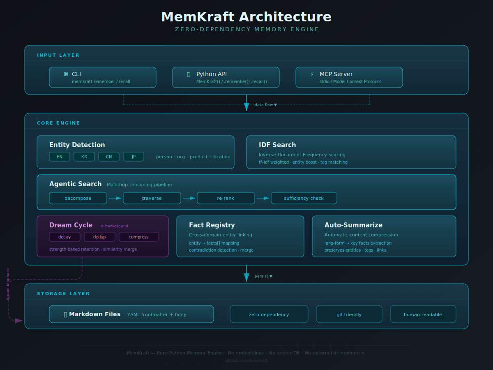

<div align="center">


# MemKraft

**Zero-dependency compound memory for AI agents.**

Your agent forgets everything between conversations.<br>
MemKraft gives it a memory that compounds — structured, traceable, self-maintaining.

[](https://pypi.org/project/memkraft/)
[](LICENSE)
[](https://pypi.org/project/memkraft/)
[](https://pypi.org/project/memkraft/)
[](#)

[Quick Start](#quick-start) · [Why MemKraft?](#why-memkraft) · [Features](#features) · [Architecture](#architecture) · [Comparison](#comparison) · [Docs](#how-it-works--technical-design)

</div>

---

## Quick Start

Install and go from zero to compound memory in 30 seconds:

```bash
pip install memkraft
```

```bash
# 1. Initialize
memkraft init

# 2. Extract entities and facts from any text
memkraft extract "Simon Kim is the CEO of Hashed. Hashed is a VC in Seoul." \
    --source "news article"

# 3. Search your memory
memkraft search "venture capital" --fuzzy

# 4. Get a meeting brief — all context in one place
memkraft brief "Simon Kim"
```

That's it. No API keys, no database, no config files. Everything is plain Markdown in a `memory/` directory you own.

<details>
<summary><b>See all 6 daily patterns</b></summary>

```bash
# Pattern 1: Extract & Track — auto-detect entities from any text
memkraft extract "Simon Kim is the CEO of Hashed in Seoul." --source "news"
memkraft track "Simon Kim" --type person --source "X/@simonkim_nft"
memkraft update "Simon Kim" --info "Launched MemKraft" --source "X/@simonkim_nft"

# Pattern 2: Search & Recall — find anything in your memory
memkraft search "venture capital" --fuzzy
memkraft lookup "Simon" --brain-first
memkraft agentic-search "who is the CEO of Hashed"

# Pattern 3: Meeting Prep — compile all context before a meeting
memkraft brief "Simon Kim"
memkraft links "Simon Kim"

# Pattern 4: Ingest & Classify — inbox → structured pages (safe by default)
memkraft cognify            # recommend-only; add --apply to move files
memkraft detect "Jack Ma and 马化腾 discussed AI" --dry-run

# Pattern 5: Log & Reflect — structured audit trail
memkraft log --event "Deployed v0.2" --tags deploy --importance high
memkraft retro              # daily Well / Bad / Next retrospective

# Pattern 6: Maintain & Heal — Dream Cycle keeps memory healthy
memkraft dream --dry-run    # nightly: sources, duplicates, bloated pages
memkraft diff               # what changed since last maintenance?
memkraft open-loops         # find all unresolved items
```

All 20+ commands available from day one. These 6 patterns cover 90% of daily use.

</details>

---

## Why MemKraft?

### The Problem

AI agents start every conversation from zero. Six months of conversations later, the agent still doesn't *know* anything — it just searches faster.

- Context windows fill up. Important facts get lost.
- No compound returns — conversation 100 is no better-informed than conversation 1.
- When an agent *does* recall something, you can't tell if it's real or hallucinated.

**Agents without compound memory don't learn. They search.**

### The Solution

MemKraft forges **long-lived, compound knowledge** — structured, traceable, and self-maintaining.

```
Raw Input ──▶ Extract ──▶ Classify ──▶ Forge ──▶ Compound Knowledge
     ▲                                                │
     └──────────── Brain-first recall ◄───────────────┘
                        maintained by Dream Cycle ◀── nightly
```

Every fact has a source. Every entity has a timeline. Every night, Dream Cycle cleans the dross. Your next conversation starts sharper than the last one.

### Design Principles

| Principle | What it means |
|-----------|--------------|
| **Memory compounds** | Each conversation builds on all prior ones. The 100th conversation is the best-informed. |
| **Structure enforces quality** | RESOLVER prevents duplicates. Source Attribution enforces trust. Tiers prioritize what matters. |
| **Maintenance is automated** | Dream Cycle keeps memory healthy — no manual curation required. |
| **Knowledge is portable** | Plain Markdown, zero dependencies, any framework. If MemKraft disappears, your memory is still readable. |
| **Provenance is non-negotiable** | Every fact traces back to a source. Facts without sources are trust debts. |
| **Context is finite** | Memory tiers ensure the right information fills the context window. Bloated pages get flagged. Inspired by [Recursive Language Models (Zhang et al., 2025)](https://arxiv.org/abs/2512.24601). |

---

## Features

### Ingestion & Extraction

| Feature | Description |
|---------|------------|
| **Auto-extract** | Pipe any text → entities + facts auto-detected. Regex-based NER for EN, KR, CN, JP — no LLM calls. |
| **CJK entity detection** | 806 stopwords, 100 CN surnames, 85 JP surnames, Korean particle stripping. Works out of the box. |
| **Cognify pipeline** | Routes `inbox/` items to the right directory. Recommend-only by default — add `--apply` to move. |
| **Fact registry** | Extracts currencies, percentages, dates, quantities into a cross-domain index. |
| **Originals capture** | Save raw text verbatim — no paraphrasing, no interpretation loss. |

### Search & Retrieval

| Feature | Description |
|---------|------------|
| **Fuzzy search** | `difflib.SequenceMatcher` — works offline, on a plane, with zero setup. |
| **Brain-first lookup** | Searches entities → notes → decisions → meetings. Stops after sufficient high-relevance results. |
| **Agentic search** | Multi-hop: decompose query → search → traverse `[[wiki-links]]` → re-rank by tier/recency. |
| **Progressive disclosure** | 3-level query: L1 index scan (~50 tokens), L2 section headers, L3 full file. |
| **Backlinks** | Wiki-style `[[entity-name]]` cross-references. See every page that references an entity. |
| **Link suggestions** | Auto-suggest missing `[[wiki-links]]` based on known entity names. |

### Structure & Organization

| Feature | Description |
|---------|------------|
| **Compiled Truth + Timeline** | Dual-layer entity model: mutable current state + append-only audit trail. |
| **Memory tiers** | Core / Recall / Archival — explicit context window priority with `promote` command. |
| **RESOLVER.md** | MECE classification tree — every piece of knowledge has exactly one destination. |
| **Source attribution** | Every fact tagged with `[Source: who, when, how]`. Enforced by Dream Cycle. |
| **Live Notes** | Persistent tracking for people/companies. Auto-incrementing updates + timeline. |

### Maintenance & Audit

| Feature | Description |
|---------|------------|
| **Dream Cycle** | Nightly auto-maintenance: sources, thin pages, duplicates, inbox age, bloated pages, daily notes. |
| **Memory decay** | Older, unaccessed memories naturally decay — keeps the knowledge base fresh. |
| **Fact dedup** | Automatically detects and merges duplicate facts across entities. |
| **Auto-summarize** | Condenses bloated pages while preserving key information. |
| **Diff tracking** | See exactly what changed since the last Dream Cycle. |
| **Open loop tracking** | Finds all pending/TODO/FIXME items across your entire memory. |

### Logging & Reflection

| Feature | Description |
|---------|------------|
| **Session logging** | JSONL event trail with tags, importance, entity, task, and decision fields. |
| **Daily retrospective** | Auto-generated Well / Bad / Next from events + file changes. |
| **Decision distillation** | Scans events and notes for decision candidates (EN + KR keyword matching). |
| **Meeting briefs** | One command compiles entity info, timeline, open threads, and a pre-meeting checklist. |

---

## Architecture

<p align="center">
  
</p>

<details>
<summary>Text-based architecture diagram</summary>

```
┌──────────────────────────────────────────────────────────┐
│                        MemKraft                          │
│                The Compound Knowledge Engine              │
│                                                          │
│  ┌──────────┐  ┌──────────┐  ┌──────────┐              │
│  │  Extract  │─▶│ RESOLVER │─▶│ Classify │              │
│  │(auto-detect)│ │ (MECE   │─▶│ & Route  │              │
│  └──────────┘  │  tree)   │  └────┬─────┘              │
│  ┌──────────┐  └──────────┘       │                     │
│  │  Inbox    │──────▶ Cognify ────┘                     │
│  │ (capture) │     (recommend    │                     │
│  └──────────┘      by default)   │                     │
│                                     ▼                    │
│  ┌──────────┐  ┌──────────┐  ┌──────────┐              │
│  │ Decisions │  │ Entities │  │Live Notes│              │
│  │ (why)     │  │ (who)    │  │ (track)  │              │
│  └─────┬────┘  └─────┬────┘  └─────┬────┘              │
│        │             │             │                     │
│        └─────────────┼─────────────┘                     │
│                      ▼                                   │
│  ┌──────────────┐  ┌──────────────┐                     │
│  │ Dream Cycle  │  │   Sessions    │                     │
│  │ (auto-heal)  │  │  (JSONL log)  │                     │
│  │ • sources    │  │              │                     │
│  │ • thin pages  │  └──────┬───────┘                     │
│  │ • duplicates  │         │                              │
│  │ • inbox age   │         ▼                              │
│  │ • bloated     │  ┌──────────────┐                     │
│  │ • daily note  │  │  Retro &     │                     │
│  └──────┬───────┘  │  Distill      │                     │
│         │           └──────────────┘                     │
│         ▼                                                 │
│  ┌──────────────┐  ┌──────────────┐                     │
│  │    Diff      │  │  Open Loops  │                     │
│  │ (changes)    │  │  (unresolved)│                     │
│  └──────────────┘  └──────────────┘                     │
│                                                           │
│  ┌──────────────────────────────────────────────┐       │
│  │ Progressive Disclosure: query --level 1|2|3    │       │
│  │ Brain-first Lookup: entities → notes → ...    │       │
│  │ Memory Index: .memkraft/index.json            │       │
│  │ Source Attribution: [Source: who, when, how]  │       │
│  │ Memory Tiers: core | recall | archival         │       │
│  │ Backlinks: [[entity-name]]                    │       │
│  │ Fact Registry: cross-domain numeric index     │       │
│  └──────────────────────────────────────────────┘       │
└──────────────────────────────────────────────────────────┘
```

</details>

### Memory Directory Structure

```
memory/
├── .memkraft/           # Internal state (index.json, timestamps)
├── sessions/            # Structured event logs (YYYY-MM-DD.jsonl)
├── RESOLVER.md          # Classification decision tree (MECE)
├── TEMPLATES.md         # Page templates with tier labels
├── open-loops.md        # Unresolved items hub (auto-generated)
├── fact-registry.md     # Cross-domain numeric/date facts
├── YYYY-MM-DD.md        # Daily notes (auto-created by Dream Cycle)
├── entities/            # People, companies, concepts (Tier: recall)
├── live-notes/          # Persistent tracking targets (Tier: core)
├── decisions/           # Why we decided what we decided
├── originals/           # Captured verbatim — no paraphrasing
├── inbox/               # Quick capture before classification
├── tasks/               # Work-in-progress context
└── meetings/            # Briefs and notes
```

---

## Comparison

> Honest comparison. MemKraft isn't the right choice for every use case.

| | **MemKraft** | **Mem0** | **Letta** | **GBrain** | **Rowboat** |
|---|:---:|:---:|:---:|:---:|:---:|
| **Storage** | Plain Markdown | Vector + Graph DB | DB-backed | Plain Markdown | Plain Markdown |
| **Dependencies** | Zero | Vector DB + API | DB + runtime | Zero | Desktop app |
| **Framework** | Any | API-first (Py/JS) | Agent framework | Claude-specific | Obsidian |
| **Offline / git-friendly** | Yes | No | No | Yes | Yes |
| | | | | | |
| Auto-extract (EN/KR/CN/JP) | Yes | Yes (LLM) | — | — | — |
| Cognify pipeline | Yes | — | — | — | — |
| Progressive disclosure | Yes | — | — | — | — |
| Agentic search | Yes | — | — | — | — |
| Fuzzy search | Yes | Yes (vector) | — | — | — |
| **Semantic search** | **No** | **Yes** | — | — | — |
| **Graph memory** | **No** | **Yes** | — | — | — |
| **Self-editing memory** | **No** | — | **Yes** | — | — |
| **Virtual context mgmt** | **No** | — | **Yes** | — | — |
| Source attribution | Required | — | — | Yes | — |
| Memory tiers | Yes | — | Yes | — | — |
| Dream Cycle | Yes | — | — | — | — |
| Memory decay + dedup | Yes | — | — | — | — |
| Auto-summarize | Yes | — | Yes | — | — |
| Live tracking | Yes | — | — | — | Yes |
| Meeting prep | Yes | — | — | — | Yes |
| Session logging | Yes | — | — | — | — |
| Backlinks | Yes | — | — | — | — |
| Open loop tracking | Yes | — | — | — | — |
| Decision distillation | Yes | — | — | — | — |
| **Cost** | Free | Free tier + paid | Free | Free | Free |

<details>
<summary><b>Where each tool shines</b></summary>

- **Mem0** — Best for API-first integration with vector retrieval and graph traversal. Strongest at semantic search and automatic memory extraction. MemKraft takes the auto-extraction idea but keeps everything in readable, git-friendly Markdown.

- **Letta** (MemGPT) — Best when you want a complete agent runtime with automatic context paging and self-editing memory. Pioneered tiered memory and virtual context management. MemKraft adopts tiers as a lightweight convention without requiring a runtime.

- **GBrain** — Best for Claude-specific workflows. The compiled-truth + timeline model was a direct inspiration. MemKraft generalizes it to be framework-agnostic and adds Dream Cycle, auto-extraction, and cognify.

- **Rowboat** — Best as an Obsidian desktop app for human-in-the-loop workflows. MemKraft incorporates live-tracking and meeting briefs into a CLI-first, programmable workflow that agents can call directly.

**Choose MemKraft when:** you want compound memory that's portable, transparent, git-friendly, and works with any agent framework — without needing a database, API keys, or a running service.

**Choose something else when:** you need semantic/vector search, graph traversal, or a full agent runtime with virtual context management.

</details>

---

<details>
<summary><h2>How It Works — Technical Design</h2></summary>

### Zero-dependency Philosophy

MemKraft runs on **Python 3.9+ with zero external dependencies**. No vector databases, no LLM API calls at runtime, no framework lock-in. Built entirely from the standard library: `re` for pattern matching, `difflib` for fuzzy search, `json` for structured data, `pathlib` for file operations.

Why? Because memory should be **portable and permanent**. A Markdown file from 2026 is still readable in 2036. A vector embedding from a proprietary model may not even decode. When you `git push` your memory directory, you're backing up knowledge in its most durable form.

### Compiled Truth + Timeline (Dual-Layer Entity Model)

Every entity page is forged in two layers:

- **Compiled Truth** — the current state. Mutable, always rewritable. This is what an LLM reads first: role, affiliation, key context. When facts change, you re-forge this section.
- **Timeline** — an append-only log of every event, each tagged with `[Source: who, when, how]`. Never edited, only appended.

Why dual-layer? Because a single "current state" page silently overwrites history. The timeline is an audit trail — it makes every claim traceable. Compiled Truth makes it actionable. Together, they give you both *what we know now* and *how we got here*.

### Auto-Extract: Entity and Fact Detection

`memkraft extract` runs a multi-stage detection pipeline:

1. **English names** — regex for Title Case patterns, filtered against a common-word blocklist
2. **Korean names** — Hangul syllable extraction with particle stripping (조사 제거: 이, 을, 를, 은, 는, 에, 로...) and verb-suffix removal
3. **Chinese names** — surname-first detection using 100 built-in Chinese surnames (王李张刘陈杨赵黄周吴...)
4. **Japanese names** — surname-matched detection against 85 Japanese surnames (田中, 佐藤, 鈴木, 高橋...)
5. **Fact extraction** — pattern matching for "X is/was/founded/leads Y" in English and Korean
6. **Stopword filtering** — 806 KR/CN/JP stopwords loaded from `stopwords.json`, cached per session

### Cognify: Inbox Classification

The `cognify` command processes `inbox/` items and recommends routing:

- Contains "decided", "decision", "chose" → `decisions/`
- Contains "todo", "task", "action item" → `tasks/`
- Contains role words (CEO, CTO, founder, investor) → `entities/`
- Default → `entities/` for manual review

**Recommend-only by default.** Add `--apply` to actually move files. Files under 20 characters are skipped.

### Source Attribution: Trust Chain

Every fact carries a `[Source: who, when, how]` tag. Dream Cycle scans for entries without attribution and flags them. Facts without sources are trust debts — they work until they don't. MemKraft makes the debt visible.

### Memory Tiers: Context Window Management

- **Core** — always in context. Live Notes default. Active people and projects.
- **Recall** — searchable, included when relevant. Entity default.
- **Archival** — historical, rarely accessed. Old decisions, completed projects.

`memkraft promote` reclassifies tiers as priorities shift.

### Dream Cycle: Automated Maintenance

Six nightly health checks:

1. **Daily note fallback** — auto-creates daily note if missing
2. **Incomplete source attributions** — flags timeline entries without `[Source: ...]`
3. **Thin entity pages** — flags pages under 300 bytes
4. **Duplicate entity detection** — normalizes slugs, flags potential duplicates (e.g., `simon-kim` ↔ `김서준`)
5. **Overdue inbox items** — flags anything in `inbox/` older than 48 hours
6. **Bloated pages** — flags pages over 4KB for compaction

### Fuzzy Search

Uses `difflib.SequenceMatcher` — no embedding model, no API calls. Compares the query against every line in every memory file, keeping matches above a 0.3 similarity threshold with ±3 lines of context. Works offline, in CI, on a plane.

### Backlinks

`[[entity-name]]` syntax (compatible with Obsidian, Logseq). `memkraft links "Entity Name"` scans all `.md` files and returns referencing files with surrounding context.

### RESOLVER.md: MECE Classification

A decision tree that ensures every piece of knowledge has exactly one correct destination. Prevents the two most common memory diseases: duplicates and orphans.

</details>

---

<details>
<summary><h2>Full CLI Demo</h2></summary>

```bash
# Initialize the forge
$ memkraft init
✅ MemKraft initialized at memory

# Auto-extract entities and facts from any text
$ memkraft extract "Simon Kim is the CEO of Hashed. Hashed is a VC in Seoul." \
    --source "X/@simonkim_nft"
[
  {"name": "Simon Kim", "type": "person", "context": "auto-detected", "source": "X/@simonkim_nft", "action": "created", "path": "entities/simon-kim.md"},
  {"entity": "Simon Kim", "fact": "the CEO of Hashed", "action": "appended"}
]

# Start tracking someone persistently
$ memkraft track "Simon Kim" --type person --source "X/@simonkim_nft"
✅ Tracking: memory/live-notes/simon-kim.md

# Update with new info
$ memkraft update "Simon Kim" --info "Open-sourced MemKraft under MIT" \
    --source "X/@simonkim_nft, 2026-04-10"
✅ Updated: memory/live-notes/simon-kim.md

# Promote to core memory (always in context)
$ memkraft promote "Simon Kim" --tier core
✅ Promoted 'Simon Kim' → core

# Get a meeting brief
$ memkraft brief "Simon Kim"

📋 Meeting Brief: Simon Kim
Generated: 2026-04-11

👤 Entity Info
   CEO of Hashed. VC based in Seoul.

🔄 Live Note
   Current State: CEO of Hashed, building MemKraft, the compound knowledge engine
   Recent Activity:
   - 2026-04-10 | Open-sourced MemKraft [Source: X/@simonkim_nft]

📅 Timeline
   - 2026-04-11 | Entity first detected [Source: Telegram]
   - 2026-04-10 | MemKraft MIT release [Source: X/@simonkim_nft]

🔓 Open Threads
   - [ ] Initial entity — enrichment needed

# Detect CJK entities
$ memkraft detect "马化腾和李彦宏讨论了人工智能" --dry-run
[
  {"name": "马化腾", "type": "person", "context": "auto-detected (Chinese)"},
  {"name": "李彦宏", "type": "person", "context": "auto-detected (Chinese)"}
]

# Process inbox
$ memkraft cognify
🧠 Cognify complete (recommend mode): 3 processed, 1 skipped
   → meeting-notes.md: decision (use --apply to move)
   → decision-001.md: decision (use --apply to move)
   → action-items.md: task (use --apply to move)

# Progressive Disclosure Query
$ memkraft query simon --level 1
  2026-04-11 live-notes/simon-kim.md
    - **2026-04-11** | Tracking started

$ memkraft query --level 2 --date 2026-04-11
  📄 live-notes/simon-kim.md
    # Simon Kim (Live Note)
    ## Tracking Config
    ## Current State
    ## Recent Activity
    ## Key Points

# Session Event Logging
$ memkraft log --event "Deployed v0.2 to production" --tags deploy,release --importance high
📝 Logged: Deployed v0.2 to production

$ memkraft log --read
📋 Session events for 2026-04-11 (2 events):
  🔴 14:30:00 Deployed v0.2 to production [deploy,release]
  ⚪ 11:00:00 Bug fix applied [bug]

# Daily Retrospective
$ memkraft retro
🔄 Daily Retrospective — 2026-04-11
✅ Well (went well):
  • Deployed v0.2 to production
⚠️ Bad (issues):
  • (none)
➡️ Next (action items):
  • (none)
👥 Entities touched: MemKraft

# Distill decision candidates
$ memkraft distill-decisions
📋 Decision candidates (1):
  [high] sessions/2026-04-11.jsonl: decided to use MemKraft over alternatives

# Track unresolved items
$ memkraft open-loops
🔓 Open Loops (2):
  [2026-04-11] live-notes/simon-kim.md: - [ ] Initial setup — enrichment needed
  [2026-04-10] decisions/stack.md: ⏳ pending team approval

# Build memory index
$ memkraft index
📇 Index built: 15 files → .memkraft/index.json

# Suggest missing wiki-links
$ memkraft suggest-links
🔗 Link suggestions (1):
  meetings/2026-04-10-hashed.md: add [[simon-kim]] — "CEO of Hashed, building MemKraft"

# Extract numeric/date facts
$ memkraft extract-facts "Revenue $5.3M, 85% growth, 42 employees, deadline 2026-06-30"
📊 Facts extracted (4):
  • $5.3M
  • 85%
  • 42 employees
  • 2026-06-30

# Brain-first lookup
$ memkraft lookup "Simon" --brain-first
  [high] live-note: simon-kim
  (brain-first: stopped after 2 high-relevance results. Use --full for all.)

# Fuzzy search
$ memkraft search "venture capital Seoul" --fuzzy
  [0.72] entities/simon-kim.md
     Simon Kim | CEO of Hashed. VC based in Seoul.
  [0.58] entities/hashed.md
     Hashed | VC firm in Seoul, blockchain-focused

# Backlinks
$ memkraft links "Simon Kim"
Backlinks to 'Simon Kim' (3):
  📎 entities/hashed.md
     ...CEO [[simon-kim]] founded Hashed in 2018...
  📎 decisions/seed-round.md
     ...introduced by [[simon-kim]]...
  📎 live-notes/memkraft.md
     ...[[simon-kim]] open-sourced MemKraft...

# Diff — what changed since last maintenance?
$ memkraft diff
Changes since last Dream Cycle (4):
  🆕 created: entities/simon-kim.md (2026-04-11 16:00)
  ✏️ modified: entities/hashed.md (2026-04-11 15:30)

# Dream Cycle
$ memkraft dream --dry-run
🌙 Dream Cycle — 2026-04-11
   Mode: dry-run
   🔍 Scanning for incomplete source attributions...
      ⚠️ entities/hashed.md: timeline entry missing [Source: ...]
   🔍 Scanning for thin entity pages...
   🔍 Scanning for duplicate entities...
      ⚠️ Possible duplicate: simon-kim ↔ 김서준
   🔍 Scanning for inbox overdue items...
   🔍 Scanning for bloated pages (auto-compact)...
🌙 Dream Cycle complete: 3 total issues found
   Incomplete sources: 1
   Thin entities: 0
   Duplicate entities: 1
   Inbox overdue: 0
   Bloated pages: 1

# Capture raw text verbatim
$ echo "Simon: 'We're building the memory layer that agents actually need.'" \
    > memory/originals/simon-2026-04-11.md

# RESOLVER.md — classification decision tree
$ cat memory/RESOLVER.md
# RESOLVER — Classification Decision Tree
## Is it a person, company, or concept? → entities/
## Is it a decision with rationale? → decisions/
## Is it raw capture before processing? → inbox/ then cognify
## Is it verbatim text to preserve? → originals/
```

</details>

---

## Installation

```bash
# Recommended — isolated install with pipx
pipx install memkraft

# Or with pip
pip install memkraft

# Run without installing
pipx run memkraft brief

# From source
git clone https://github.com/seojoonkim/memkraft.git
cd memkraft && pipx install .
```

<details>
<summary>Don't have pipx?</summary>

```bash
brew install pipx     # macOS
pipx ensurepath
```

</details>

**Requirements:** Python 3.9+. Nothing else.

### Configuration

```bash
# Set memory directory (default: ./memory)
export MEMKRAFT_DIR=/path/to/your/memory
```

---

## Contributing

PRs welcome. See [CONTRIBUTING.md](CONTRIBUTING.md).

## License

[MIT](LICENSE) — use it however you want.

---

<div align="center">

**MemKraft** — *Forge your memory. Compound your knowledge.*

[GitHub](https://github.com/seojoonkim/memkraft) · [PyPI](https://pypi.org/project/memkraft/) · [Issues](https://github.com/seojoonkim/memkraft/issues)

</div>
