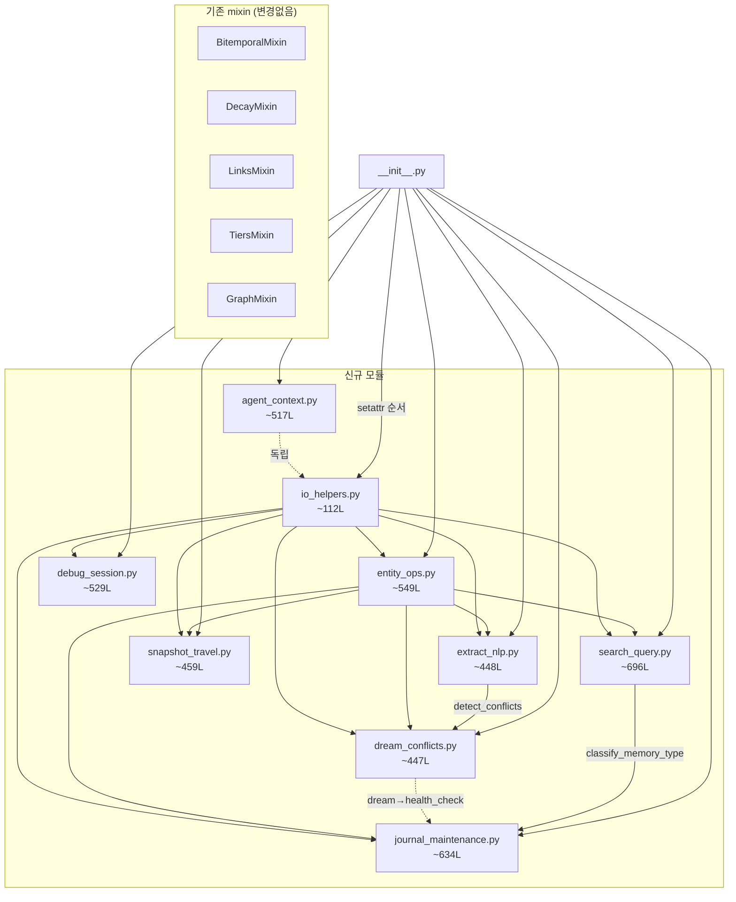

# V2.1 core.py 모듈 분해 설계안

> **작성일:** 2026-04-26  
> **브랜치:** feat/v2.1-roadmap  
> **원본 파일:** `src/memkraft/core.py`  
> **작성 기준:** 코드 분석 only — 코드 수정 없음

---

## 1. 현황

| 항목 | 값 |
|------|------|
| 전체 줄 수 | **4,435 줄** |
| 전체 메서드 수 | **110개** (`def` 기준) |
| Public 메서드 | **66개** (60%) |
| Private 메서드 (`_` 접두사) | **44개** (40%) |
| 클래스 | 1개 (`MemKraft`) |
| 임포트 | stdlib only (`hashlib`, `json`, `os`, `re`, `shutil`, `sys`, `uuid`, `datetime`, `difflib`, `pathlib`, `typing`) |

### 현재 mixin 패턴 (`__init__.py`)

이미 15개 mixin이 `setattr` 방식으로 `MemKraft` 클래스에 동적 주입됨:

```
BitemporalMixin, DecayMixin, LinksMixin, TiersMixin,
IncidentMixin, RunbookMixin, RCAMixin, DecisionStoreMixin,
PromptTuneMixin, PromptEvidenceMixin, ConvergenceMixin,
SearchMixin, ChunkingMixin, LifecycleMixin, GraphMixin
```

`core.py`는 이 시스템의 **베이스 클래스 + 핵심 비즈니스 로직**을 담당.  
기존 mixin과의 네이밍 충돌 없이 동일한 패턴으로 분리 가능.

---

## 2. 분해 후보 모듈 (9개)

### 모듈 배정 원칙
- 각 모듈은 **단일 책임** 원칙
- 모든 public 메서드는 **정확히 1개 모듈**에 매핑
- 분리 후 `__init__.py`에서 기존 mixin 패턴으로 등록
- **합계 ≤ 4,435줄** 보장 (예상: ~4,391줄)

---

### 모듈 1: `entity_ops.py` — 엔티티 CRUD

**책임:** 엔티티 생성·조회·갱신·감지 (track/update/brief/detect)

| 메서드 | 라인 범위 | 줄 수 | 공개여부 |
|--------|-----------|------|--------|
| `__init__` | L46–L64 | 19 | — |
| `init` | L65–L139 | 75 | public |
| `track` | L140–L197 | 58 | public |
| `update` | L198–L254 | 57 | public |
| `list_entities` | L255–L289 | 35 | public |
| `brief` | L290–L413 | 124 | public |
| `detect` | L414–L427 | 14 | public |
| `_append_fact` | L1125–L1157 | 33 | private |
| `_apply_state_changes` | L1051–L1085 | 35 | private |
| `_extract_state_candidates` | L1086–L1115 | 30 | private |
| `_is_material_state_change` | L1116–L1124 | 9 | private |
| `_slugify` | L3649–L3654 | 6 | private |
| `_strip_korean_josa` | L3843–L3850 | 8 | private |
| `_create_entity` | L3797–L3842 | 46 | private |

**예상 줄 수:** ~549L  
**의존성 (수신):** `io_helpers.py` (_safe_read, _extract_section, _first_meaningful_line)

---

### 모듈 2: `dream_conflicts.py` — 드림 사이클 + 충돌 감지

**책임:** 야간 메모리 정리 사이클(dream), 팩트 충돌 감지·해결

| 메서드 | 라인 범위 | 줄 수 | 공개여부 |
|--------|-----------|------|--------|
| `dream` | L428–L607 | 180 | public |
| `_compression_suggestion` | L608–L631 | 24 | private |
| `detect_conflicts` | L632–L675 | 44 | public |
| `_is_opposing` | L676–L717 | 42 | private |
| `_extract_bullet_facts` | L718–L733 | 16 | private |
| `_tag_conflict` | L734–L756 | 23 | private |
| `_write_conflicts_report` | L757–L779 | 23 | private |
| `resolve_conflicts` | L780–L874 | 95 | public |

**예상 줄 수:** ~447L  
**의존성 (수신):** `io_helpers.py` (_safe_read, _all_md_files), `entity_ops.py` (health_check → dream에서 호출)  
**의존성 (발신):** `health_check` 호출 (→ journal_maintenance.py에서 분리 후 순환 주의)

> ⚠️ **주의:** `dream` → `health_check` 호출 구조가 있음. `health_check`는 `journal_maintenance.py`로 이동 예정이므로, 분리 후 크로스 임포트 처리 필요.

---

### 모듈 3: `extract_nlp.py` — 팩트 추출 + NLP

**책임:** 텍스트에서 엔티티/팩트 추출, NER 정규식 엔진, cognify

| 메서드 | 라인 범위 | 줄 수 | 공개여부 |
|--------|-----------|------|--------|
| `extract` | L875–L889 | 15 | public |
| `extract_conversations` | L890–L970 | 81 | public |
| `_extract_facts` | L971–L986 | 16 | private |
| `_resolve_extract_input` | L987–L1007 | 21 | private |
| `_extract_registry_facts` | L1008–L1028 | 21 | private |
| `_write_fact_registry` | L1029–L1050 | 22 | private |
| `cognify` | L1158–L1197 | 40 | public |
| `_classify_content` | L1198–L1212 | 15 | private |
| `_route_to_dir` | L1213–L1218 | 6 | private |
| `extract_facts_registry` | L1966–L2019 | 54 | public |
| `_detect_regex` | L3655–L3796 | 142 | private |
| `_load_stopwords` | L3946–L3960 | 15 | private |

**예상 줄 수:** ~448L  
**의존성 (수신):** `io_helpers.py` (_safe_read, _all_md_files), `entity_ops.py` (_create_entity, _slugify, _append_fact), `dream_conflicts.py` (detect_conflicts, _tag_conflict)

---

### 모듈 4: `search_query.py` — 검색 + 어제닉 다중 홉

**책임:** 하이브리드 검색(exact+IDF+fuzzy), 아제닉 멀티홉, lookup, reranking

| 메서드 | 라인 범위 | 줄 수 | 공개여부 |
|--------|-----------|------|--------|
| `promote` | L1219–L1246 | 28 | public |
| `diff` | L1247–L1284 | 38 | public |
| `search` | L1285–L1420 | 136 | public |
| `links` | L1421–L1451 | 31 | public |
| `query` | L1452–L1508 | 57 | public |
| `classify_memory_type` | L2197–L2230 | 34 | public |
| `get_decay_multiplier` | L2231–L2235 | 5 | public |
| `_goal_weighted_rerank` | L2236–L2299 | 64 | private |
| `_compute_applicability_bonus` | L2300–L2335 | 36 | private |
| `_parse_applicability` | L2336–L2347 | 12 | private |
| `_compute_confidence_bonus` | L2348–L2361 | 14 | private |
| `_extract_fact_confidence` | L2362–L2367 | 6 | private |
| `agentic_search` | L2368–L2490 | 123 | public |
| `_file_back_results` | L2491–L2520 | 30 | private |
| `_decompose_query` | L2521–L2548 | 28 | private |
| `lookup` | L2549–L2602 | 54 | public |

**예상 줄 수:** ~696L  
**의존성 (수신):** `io_helpers.py` (_safe_read, _all_md_files, _search_tokens, _best_token_snippet, _extract_tags, _gather_memory_files, _first_meaningful_line), `entity_ops.py` (_slugify)

---

### 모듈 5: `journal_maintenance.py` — 이벤트 로그 + 유지보수

**책임:** 일간 이벤트 로그, 레트로스펙티브, 헬스체크, decay/dedup/summarize

| 메서드 | 라인 범위 | 줄 수 | 공개여부 |
|--------|-----------|------|--------|
| `log_event` | L1509–L1528 | 20 | public |
| `log_read` | L1529–L1552 | 24 | public |
| `retro` | L1553–L1638 | 86 | public |
| `health_check` | L1639–L1780 | 142 | public |
| `ensure_daily_note` | L1781–L1791 | 11 | public |
| `distill_decisions` | L1792–L1842 | 51 | public |
| `open_loops` | L1843–L1880 | 38 | public |
| `build_index` | L1881–L1916 | 36 | public |
| `suggest_links` | L1917–L1965 | 49 | public |
| `decay` | L2020–L2072 | 53 | public |
| `dedup` | L2073–L2115 | 43 | public |
| `summarize` | L2116–L2196 | 81 | public |

**예상 줄 수:** ~634L  
**의존성 (수신):** `io_helpers.py` (_safe_read, _all_md_files, _extract_tags, _first_meaningful_line, _gather_memory_files), `entity_ops.py` (_slugify), `search_query.py` (classify_memory_type, get_decay_multiplier)

---

### 모듈 6: `debug_session.py` — 디버그 세션 (OHEC 사이클)

**책임:** 구조화된 디버그 세션 관리 (Observe → Hypothesize → Experiment → Conclude)

| 메서드 | 라인 범위 | 줄 수 | 공개여부 |
|--------|-----------|------|--------|
| `start_debug` | L2603–L2648 | 46 | public |
| `log_hypothesis` | L2649–L2705 | 57 | public |
| `get_hypotheses` | L2706–L2742 | 37 | public |
| `reject_hypothesis` | L2743–L2787 | 45 | public |
| `confirm_hypothesis` | L2788–L2826 | 39 | public |
| `log_evidence` | L2827–L2866 | 40 | public |
| `get_evidence` | L2867–L2893 | 27 | public |
| `end_debug` | L2894–L2941 | 48 | public |
| `get_debug_status` | L2942–L2987 | 46 | public |
| `debug_history` | L2988–L3023 | 36 | public |
| `search_rejected_hypotheses` | L3024–L3068 | 45 | public |
| `search_debug_sessions` | L3069–L3104 | 36 | public |
| `_get_debug_file` | L3105–L3112 | 8 | private |
| `_update_debug_status` | L3113–L3121 | 9 | private |
| `_append_debug_timeline` | L3122–L3131 | 10 | private |

**예상 줄 수:** ~529L  
**의존성 (수신):** `io_helpers.py` (_safe_read)  
**내부 의존성:** 15개 메서드 대부분이 `_get_debug_file` + `_safe_read` 중심으로 자기완결적

---

### 모듈 7: `agent_context.py` — 에이전트 컨텍스트 + 태스크

**책임:** 멀티에이전트 컨텍스트 공유, 태스크 핸드오프, 채널 관리

| 메서드 | 라인 범위 | 줄 수 | 공개여부 |
|--------|-----------|------|--------|
| `channel_save` | L3132–L3150 | 19 | public |
| `channel_load` | L3151–L3158 | 8 | public |
| `channel_update` | L3159–L3209 | 51 | public |
| `task_start` | L3210–L3245 | 36 | public |
| `task_delegate` | L3246–L3281 | 36 | public |
| `task_update` | L3282–L3301 | 20 | public |
| `task_complete` | L3302–L3323 | 22 | public |
| `task_history` | L3324–L3332 | 9 | public |
| `task_list` | L3333–L3352 | 20 | public |
| `agent_save` | L3353–L3371 | 19 | public |
| `agent_load` | L3372–L3379 | 8 | public |
| `agent_inject` | L3380–L3463 | 84 | public |
| `agent_handoff` | L3464–L3543 | 80 | public |
| `channel_tasks` | L3544–L3572 | 29 | public |
| `task_cleanup` | L3573–L3631 | 59 | public |
| `_json_load` | L3632–L3641 | 10 | private |
| `_json_save` | L3642–L3648 | 7 | private |

**예상 줄 수:** ~517L  
**의존성 (수신):** 없음 (자기완결 — `_json_load`/`_json_save`로만 I/O)

---

### 모듈 8: `io_helpers.py` (신규) — I/O + 텍스트 유틸리티

**책임:** 파일 읽기/쓰기, 메모리 파일 수집, 텍스트 토큰화 공통 유틸

| 메서드 | 라인 범위 | 줄 수 | 공개여부 |
|--------|-----------|------|--------|
| `_extract_section` | L3851–L3862 | 12 | private |
| `_all_md_files` | L3863–L3875 | 13 | private |
| `_safe_read` | L3876–L3882 | 7 | private |
| `_gather_memory_files` | L3883–L3907 | 25 | private |
| `_search_tokens` | L3908–L3911 | 4 | private |
| `_best_token_snippet` | L3912–L3927 | 16 | private |
| `_first_meaningful_line` | L3928–L3938 | 11 | private |
| `_extract_tags` | L3939–L3945 | 7 | private |
| `_get_version` | L3961–L3968 | 8 | private |
| `_file_hash` | L3969–L3977 | 9 | private |

**예상 줄 수:** ~112L  
**의존성 (수신):** 없음 (stdlib only)  
**의존성 (발신):** 모든 모듈이 이 모듈에 의존 → **베이스 mixin 최우선 등록**

---

### 모듈 9: `snapshot_travel.py` (기존 core에서 분리 또는 신규 mixin)

**책임:** 스냅샷 생성/비교, 타임트래블 쿼리

| 메서드 | 라인 범위 | 줄 수 | 공개여부 |
|--------|-----------|------|--------|
| `snapshot` | L3978–L4055 | 78 | public |
| `snapshot_list` | L4056–L4085 | 30 | public |
| `_load_snapshot` | L4086–L4108 | 23 | private |
| `snapshot_diff` | L4109–L4211 | 103 | public |
| `time_travel` | L4212–L4350 | 139 | public |
| `snapshot_entity` | L4351–L4435 | 86 | public |

**예상 줄 수:** ~459L  
**의존성 (수신):** `io_helpers.py` (_safe_read, _all_md_files, _first_meaningful_line, _file_hash, _search_tokens, _get_version), `entity_ops.py` (_slugify)

---

### 분해 후 라인 수 요약

| 모듈 | 예상 줄 수 |
|------|-----------|
| `entity_ops.py` | ~549L |
| `dream_conflicts.py` | ~447L |
| `extract_nlp.py` | ~448L |
| `search_query.py` | ~696L |
| `journal_maintenance.py` | ~634L |
| `debug_session.py` | ~529L |
| `agent_context.py` | ~517L |
| `io_helpers.py` | ~112L |
| `snapshot_travel.py` | ~459L |
| **합계** | **~4,391L** ✅ |

> ✅ 원본 4,435줄 이하 충족 (import 헤더 + 클래스 선언 등 보일러플레이트 제외)

---

## 3. 의존성 그래프



---

## 4. 마이그레이션 단계 (PR 단위)

### PR 1: `io_helpers.py` 분리 (기반 작업)

**범위:** L3851–L3977 (10개 private 메서드)  
**작업:**
1. `src/memkraft/io_helpers.py` 파일 생성
2. `IOHelpersMixin` 클래스 정의, 10개 메서드 이동
3. `core.py`에서 해당 메서드 제거, `from .io_helpers import IOHelpersMixin` 추가
4. `__init__.py`에서 **첫 번째로** `setattr` 등록 (다른 모든 mixin보다 먼저)
5. 테스트: `pytest tests/ -x`

**리스크:** 낮음 — 모두 private, external API 변화 없음  
**예상 작업량:** 0.5일

---

### PR 2: `agent_context.py` 분리

**범위:** L3132–L3648 (17개 메서드 — channel/task/agent + _json_load/_json_save)  
**작업:**
1. `src/memkraft/agent_context.py` 파일 생성
2. `AgentContextMixin` 클래스 정의
3. `__init__.py` 등록
4. 테스트: `pytest tests/ -k agent or channel or task`

**리스크:** 낮음 — 자기완결 모듈, 의존성 최소  
**예상 작업량:** 0.5일

---

### PR 3: `debug_session.py` 분리

**범위:** L2603–L3131 (15개 메서드)  
**작업:**
1. `src/memkraft/debug_session.py` 파일 생성
2. `DebugSessionMixin` 클래스 정의
3. `__init__.py` 등록
4. 테스트: `pytest tests/ -k debug`

**리스크:** 낮음 — `_safe_read` 의존 (PR 1 완료 후 진행)  
**예상 작업량:** 0.5일

---

### PR 4: `snapshot_travel.py` 분리

**범위:** L3978–L4435 (6개 메서드)  
**작업:**
1. `src/memkraft/snapshot_travel.py` 파일 생성
2. `SnapshotTravelMixin` 클래스 정의
3. `__init__.py` 등록
4. 테스트: `pytest tests/ -k snapshot or time_travel`

**리스크:** 중간 — `_search_tokens`, `_file_hash` 등 io_helpers 의존 (PR 1 완료 후 진행)  
**예상 작업량:** 1일

---

### PR 5: `entity_ops.py` 분리

**범위:** L46–L427 + 분산된 helper (L1051–L1157, L3649–L3654, L3797–L3850) (14개 메서드)  
**작업:**
1. `src/memkraft/entity_ops.py` 파일 생성
2. `EntityOpsMixin` 클래스 정의
3. `__init__` + `init`은 `core.py`에 유지 (class setup), 나머지 이동
4. `__init__.py` 등록
5. 테스트: 전체 테스트

> ⚠️ **주의:** `__init__`은 mixin으로 이동 불가 — `core.py`에 남겨야 함. `init()` 메서드(초기화)는 이동 가능.

**리스크:** 높음 — 많은 모듈이 `_slugify`, `_create_entity` 등에 의존  
**예상 작업량:** 1일

---

### PR 6: `extract_nlp.py` 분리

**범위:** L875–L1218 + L1966–L2019 + L3655–L3796 + L3946–L3960 (12개 메서드)  
**작업:**
1. `src/memkraft/extract_nlp.py` 파일 생성
2. `ExtractNLPMixin` 클래스 정의
3. `__init__.py` 등록
4. `dream_conflicts.py`와의 크로스 의존성 처리 (detect_conflicts 임포트)

**리스크:** 높음 — `_detect_regex` (L3655–3796, 142줄)가 여러 곳에서 사용됨  
**예상 작업량:** 1.5일

---

### PR 7: `dream_conflicts.py` 분리

**범위:** L428–L874 (8개 메서드)  
**작업:**
1. `src/memkraft/dream_conflicts.py` 파일 생성
2. `DreamConflictsMixin` 클래스 정의
3. `health_check` 크로스 의존성: `dream`이 `self.health_check()`를 호출하므로, journal_maintenance PR 완료 후 진행
4. `__init__.py` 등록

**리스크:** 높음 — `dream` → `health_check` 순환 의존성 처리 필요  
**예상 작업량:** 1일

---

### PR 8: `search_query.py` 분리

**범위:** L1219–L1508 + L2197–L2602 (16개 메서드)  
**작업:**
1. `src/memkraft/search_query.py` 파일 생성
2. `SearchQueryMixin` 클래스 정의
3. `__init__.py` 등록
4. 기존 `SearchMixin` (search.py)과 중복 없는지 확인

**리스크:** 높음 — 기존 `SearchMixin` (search.py, chunking.py)과의 메서드명 충돌 가능성  
**예상 작업량:** 1.5일

---

### PR 9: `journal_maintenance.py` 분리

**범위:** L1509–L2196 (12개 메서드)  
**작업:**
1. `src/memkraft/journal_maintenance.py` 파일 생성
2. `JournalMaintenanceMixin` 클래스 정의
3. `__init__.py` 등록
4. `dream` → `health_check` 크로스 의존성 확인

**리스크:** 중간 — `health_check` (142줄, 복잡한 로직) 이동 시 다른 모듈 영향  
**예상 작업량:** 1일

---

### PR 10: `core.py` 정리 + `__init__.py` 업데이트

**작업:**
1. `core.py` 최종 상태: `__init__` + class 상수 + 남은 메서드만
2. `__init__.py`에서 신규 mixin 9개 setattr 등록
3. 전체 테스트 통과 확인
4. `CHANGELOG.md` 업데이트

**예상 작업량:** 1일

---

## 5. 리스크 & 완화

| 리스크 | 심각도 | 완화 전략 |
|--------|--------|-----------|
| `dream` → `health_check` 순환 의존성 | 🔴 높음 | PR 순서 강제: journal_maintenance(PR9) 먼저, dream_conflicts(PR7) 나중 |
| 기존 `SearchMixin` (search.py)과 이름 충돌 | 🟡 중간 | PR 8 시작 전 `grep -n "def " src/memkraft/search.py` 비교 후 충돌 메서드 확인 |
| `setattr` 등록 순서 문제 | 🟡 중간 | `io_helpers`를 반드시 최선순위 등록, 의존성 역방향으로 순서 정렬 |
| `_detect_regex` (L3655–3796) 공유 | 🟡 중간 | `extract_nlp.py`에 귀속, 다른 모듈은 `self._detect_regex()` 그대로 사용 (mixin 주입 후 동일) |
| `__init__` mixin 분리 불가 | 🟢 낮음 | `__init__` + class constants는 `core.py`에 영구 유지 |
| 테스트 커버리지 부족 | 🟡 중간 | 각 PR 전 `pytest --cov` 실행, 커버리지 80% 미만이면 PR 블로킹 |
| `fact_add` 등 bitemporal mixin 메서드 의존 | 🟢 낮음 | 기존 mixin 건드리지 않음 — core.py 내부만 분리 |

---

## 6. Public API 보존 (mixin 등록)

분리 후 `__init__.py`에 신규 mixin 등록 패턴 (기존 패턴 유지):

```python
# __init__.py 신규 추가 (기존 mixin 목록 뒤에 추가)
from .io_helpers import IOHelpersMixin          # PR 1 — 반드시 최선순위
from .agent_context import AgentContextMixin    # PR 2
from .debug_session import DebugSessionMixin    # PR 3
from .snapshot_travel import SnapshotTravelMixin # PR 4
from .entity_ops import EntityOpsMixin          # PR 5
from .extract_nlp import ExtractNLPMixin        # PR 6
from .dream_conflicts import DreamConflictsMixin # PR 7
from .search_query import SearchQueryMixin      # PR 8
from .journal_maintenance import JournalMaintenanceMixin  # PR 9

# setattr 루프에 추가 (순서 중요!)
for _mixin in (
    IOHelpersMixin,        # 기반 — 항상 먼저
    # ... 기존 mixin들 ...
    AgentContextMixin,
    DebugSessionMixin,
    SnapshotTravelMixin,
    EntityOpsMixin,
    ExtractNLPMixin,
    DreamConflictsMixin,
    SearchQueryMixin,
    JournalMaintenanceMixin,
):
    for _name, _attr in vars(_mixin).items():
        if _name.startswith("__") and _name.endswith("__"):
            continue
        setattr(_BaseMemKraft, _name, _attr)
```

**API 보존 보장:**
- 모든 `mk.track()`, `mk.search()`, `mk.dream()` 등 기존 호출 방식 **변화 없음**
- `from memkraft import MemKraft` → 동일하게 동작
- 기존 mixin (BitemporalMixin 등) **변경 없음**

---

## 7. 예상 작업량

| PR | 작업 내용 | 예상 시간 | 리스크 |
|----|-----------|----------|--------|
| PR 1 | `io_helpers.py` 분리 | 0.5일 | 낮음 |
| PR 2 | `agent_context.py` 분리 | 0.5일 | 낮음 |
| PR 3 | `debug_session.py` 분리 | 0.5일 | 낮음 |
| PR 4 | `snapshot_travel.py` 분리 | 1일 | 중간 |
| PR 5 | `entity_ops.py` 분리 | 1일 | 높음 |
| PR 6 | `extract_nlp.py` 분리 | 1.5일 | 높음 |
| PR 7 | `dream_conflicts.py` 분리 | 1일 | 높음 |
| PR 8 | `search_query.py` 분리 | 1.5일 | 높음 |
| PR 9 | `journal_maintenance.py` 분리 | 1일 | 중간 |
| PR 10 | 최종 정리 + `__init__.py` | 1일 | 중간 |
| **합계** | | **9.5일** | |

> **권장 순서:** PR 1 → (PR 2, PR 3 병렬) → PR 4 → PR 5 → PR 6 → PR 7 → PR 9 → PR 8 → PR 10  
> **최소 병렬화:** PR 2, PR 3은 PR 1 완료 후 동시 진행 가능

---

## 8. 파일 구조 변화 (Before / After)

### Before
```
src/memkraft/
├── __init__.py         # 15 mixins
├── core.py             # 4,435줄 ← 문제
├── bitemporal.py
├── chunking.py
├── convergence.py
├── decay.py
├── decision_store.py
├── doctor.py
├── graph.py
├── incident.py
├── lifecycle.py
├── links.py
├── mcp.py
├── mcp_admin.py
├── prompt_evidence.py
├── prompt_tune.py
├── rca.py
├── runbook.py
├── search.py
├── selfupdate.py
├── stats.py
├── tiers.py
└── watch.py
```

### After
```
src/memkraft/
├── __init__.py         # 24 mixins (기존 15 + 신규 9)
├── core.py             # ~200줄 (class 정의 + __init__ + constants only)
├── io_helpers.py       # 신규 ~112L ← 기반
├── entity_ops.py       # 신규 ~549L
├── dream_conflicts.py  # 신규 ~447L
├── extract_nlp.py      # 신규 ~448L
├── search_query.py     # 신규 ~696L
├── journal_maintenance.py # 신규 ~634L
├── debug_session.py    # 신규 ~529L
├── agent_context.py    # 신규 ~517L
├── snapshot_travel.py  # 신규 ~459L
└── ... (기존 모듈 변경없음)
```

---

*이 문서는 코드 분석 기반의 설계안입니다. 실제 구현 전 PR별 상세 스펙 작성 권장.*
